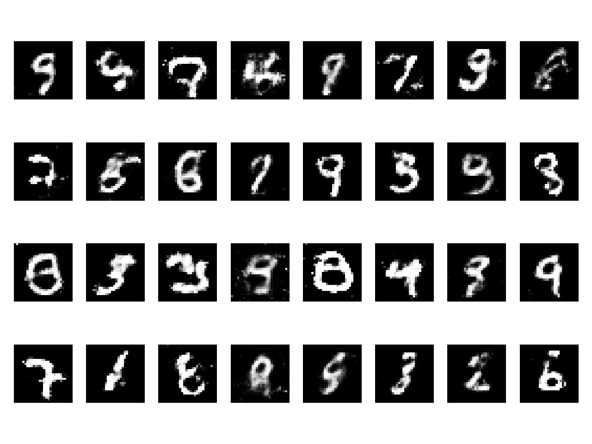
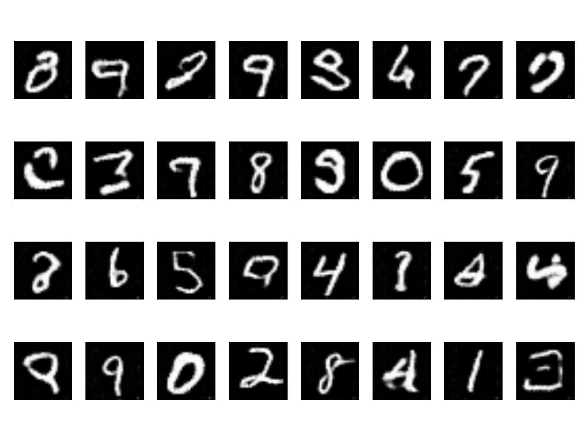

# pytorch-gan

### GAN MNIST
1. PyTorch Implementation for **Generative Adversarial Networks**
2. run `cd gan && python3 train.py` for the training process
3. run `cd gan && python3 test.py` for the testing process
   

## DCGAN MNIST
1. PyTorch Implementation For **Unsupervised Representation Learning With Deep Convolutional Generative Adversarial Networks**
2. run `cd dcgan && python3 train.py` for the training process
3. run `cd dcgan && python3 test.py` to generate fake MNIST images 

